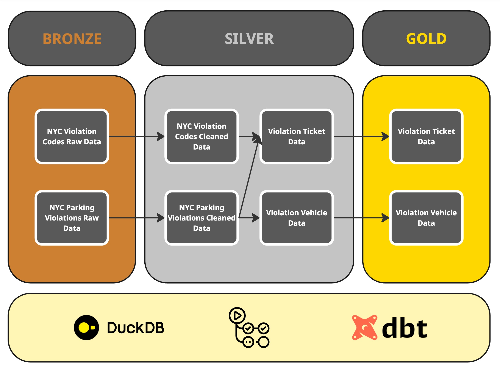

# NYC Parking Violations Analytics (dbt + DuckDB)

A dbt project that models NYC parking violations with a medallion architecture (bronze → silver → gold). The pipeline cleans raw data, enriches it with fee logic, and delivers analytics-ready tables for reporting.



**Portfolio highlights**
- End-to-end ELT pipeline in dbt with DuckDB.
- Layered modeling with clear lineage from raw to curated outputs.
- Data quality tests and documentation generation.

## Architecture
- Bronze models stage raw tables without transformation.
- Silver models standardize columns, add flags, and join fee logic.
- Gold models deliver aggregated business metrics.

## Data
- DuckDB database: `data/nyc_parking_violations.db`
- Raw tables: `parking_violations_2023`, `parking_violation_codes`
- Reference CSVs: files in `data/`

## Model Summary
- Bronze: `bronze_parking_violations`, `bronze_parking_violation_codes`
- Silver: `silver_parking_violations`, `silver_parking_violation_codes`, `silver_violation_tickets`, `silver_violation_vehicles`
- Gold: `gold_ticket_metrics`, `gold_vehicle_metrics`

## Tests
- Built-in tests on key fields (`unique`, `not_null`).
- Custom generic test `generic_not_null` for column null checks.
- Singular test `violation_codes_revenue` (warning severity).

## How to Run

**1) Create a virtual environment and install dependencies**
```bash
python -m venv .venv
source .venv/bin/activate
pip install -r requirements.txt
```

**2) Verify the profile**
The dbt profile is in `nyc_parking_violations/profiles.yml` and uses DuckDB:
- dev DB path: `data/nyc_parking_violations.db`
- prod DB path: `data/prod_nyc_parking_violations.db`

**3) Run dbt**
```bash
cd nyc_parking_violations

dbt debug
# Build models

dbt run
# Run tests

dbt test
```

**4) Generate docs**
```bash
dbt docs generate
# Serve docs locally

dbt docs serve --port 8080
```

## Project Layout
- `nyc_parking_violations/` dbt project root
- `nyc_parking_violations/models/` model layers (bronze, silver, gold)
- `nyc_parking_violations/tests/` custom tests
- `data/` DuckDB files and CSVs

## Notes
- The project expects the DuckDB file to already contain the raw tables listed above.
- If `dbt docs serve` fails in a restricted environment, run it locally or use port forwarding.

